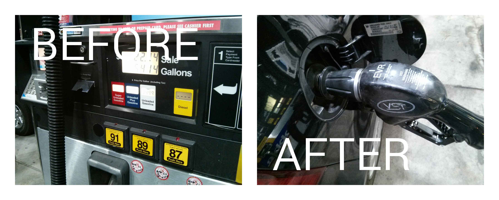

Before And After
================

###From the 11/16/2013 Google Android Hackathon

#### A meme generator of before and after sharable cameraphone pics
---------------------------------------------------------------

written in a hurry between 8:30AM and 4PM in a big strange crowded room with lots of distractions...

1. Prompts the user to take a 'before' pic and an 'after' pic.
2. The pictures are then merged into a single image with BEFORE and AFTER captions.
3. The picture is in the Android Gallery and is sharable from within the app from the menubar.

That's it!

The code is a demo of

1. calling a camera via Intent
2. getting the images
3. displaying images
4. scaling images and drawaing them on another canvas
5. notifying Android to include the pics in a scan so that they show in 'Gallery'

Issues
------
1. the share menu item shows up but doesn't respond to touching
2. the menu is hard to touch even if it did respond due to the fullscreen toggle

Todo:
-----
I stopped coding at the 'pencils down' time at the hackathon and don't intend to do any more
but if I did continue I'd add the following features:

1. Inspect the image area the text is targetted and make the text color contrast.  IE white on black and black on white.
2. Center captions
3. fix share menu
4. add sounds
5. add a side-by-side picture taking prompts layout for horizontal view and let user touch the pic placeholder they are about to take.

Sample Output
-------------

